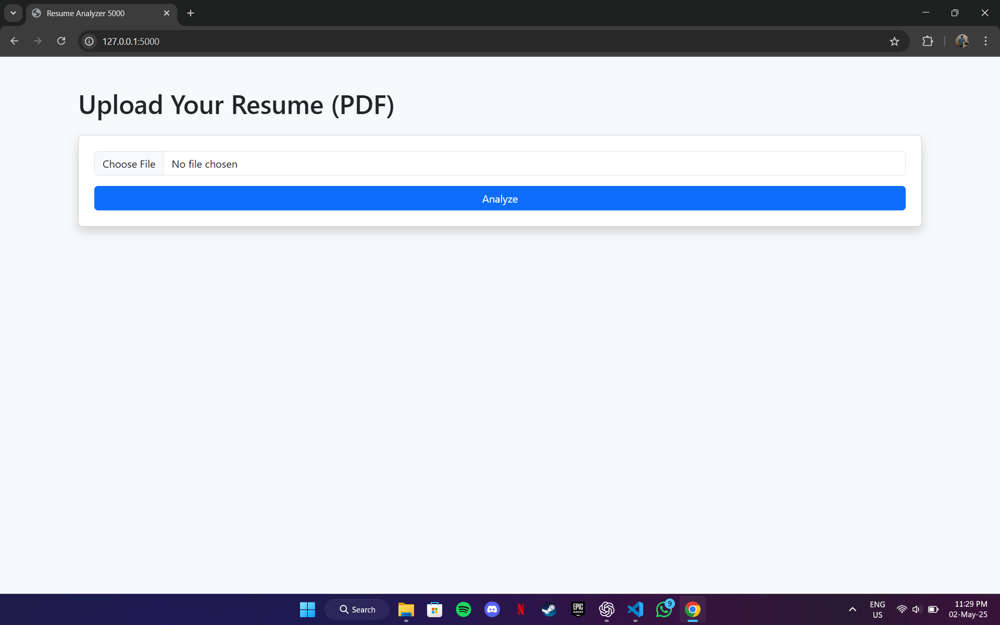
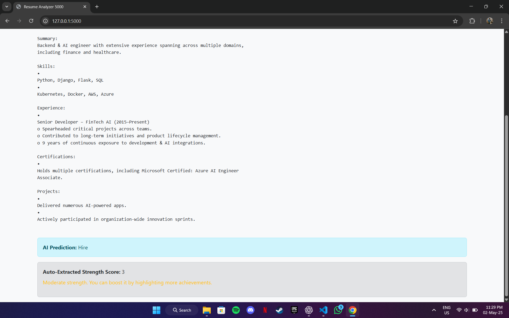

# Resume Analyzer

Hey there! 👋
This is a cool ML + Flask project I built to analyze resumes and predict whether a candidate is likely to get hired or rejected — based on key details like skills, experience, and certifications.

I wanted to blend machine learning with real-time text extraction from PDFs, and make the app super simple to use.

## Live on render
- https://resume-analyzer-waqv.onrender.com

## What it does
- Upload your resume (PDF)
- The app auto-extracts:
- Certifications 🏅
- Years of experience 📈
- Project count ✅
- Calculates a Strength Score
- Uses my trained ML model to predict: Hire / Reject
- Displays results instantly with a clean Bootstrap interface ✨

## What I used
- **Python** – all the logic & model
- **Pandas** + **scikit-learn** – for data processing + ML model
- **Flask** – for the web app
- **PyMuPDF (fitz)** – to extract text from PDF resumes
- **Bootstrap 5** – to make it clean & responsive
- **Jinja2** – for dynamic HTML rendering
- **Pickle** – to load the trained model in real-time

---

## 🖼️ Screenshots

| Form View | Prediction Result |
|-----------|-------------------|
|  |  |

---

## How to run it locally
1. **Clone the repo**
    ```bash
    git clone https://github.com/YOUR_USERNAME/resume-analyzer-5000
    cd resume-analyzer-5000

2. **Set up your virtual environment**
    ```bash
    python -m venv venv
    venv\Scripts\activate

3. **Install dependencies**
    ```bash
    pip install -r requirements.txt

4. **Run it**
    ```bash
    python app.py

Open http://127.0.0.1:5000 in your browser 🚀

## Model Details
- Logistic Regression trained on 1,000+ synthetic resumes
- Combined text features (skills) + numeric features (strength score)
- Skills (TF-IDF vectorized)
- Strength (certifications + experience + projects bucketed)
- Achieved ~90% accuracy on test set
- Pickled model + full preprocessing pipeline

## Why I built this
- To get hands-on with text extraction + ML prediction
- To understand ColumnTransformers & Pipelines in real-world apps
- To improve my Flask app skills
- And… because I had some free time to kill

## Wanna connect?
- I’m Jaspreet Singh, currently leveling up my ML + Web dev skills and aiming for a co-op in Fall 2025 🙌.
- Feel free to check out my other projects or drop me a message if you wanna chat!